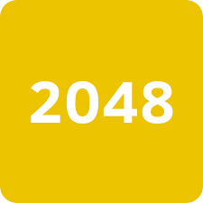

# 2048

Dette er en kopi av det populære 2048-spillet, laget som en semesteroppgave til faget INF101 (Objektorientert programmering) ved Universitet i Bergen, våren 2024. Spillet er bygget ved hjelp av Java Swing og følger de grunnleggende mekanismene til det opprinnelige 2048-spillet.

Link til YouTube video: https://youtu.be/OZbWxmrUGqw

# Komme i gang
For å spille spillet, må du kompilere og kjøre Java-kildekodene.

# Spilleregler
Bruk piltastene eller WASD for å flytte brikkene på rutenettet.

 - Trykk 'T' for å skru musikken av og på.

 - Trykk på 'M' for å gå ut og inn av menyen.

 - I menyen trykker man 'M' for å gå tilbake til det aktive spillet,
'R' for å starte et nytt spill, og 'C' for å gå til "https://www.instagram.com/martinstyve/" (hehe).

Brikker med samme tall slås sammen når de kolliderer, og dobler verdien sin.
I motsetning til originale spillet, så vil den nylig sammenslåtte brikken
slå sammen med brikken ved siden av i samme trekk, dersom disse har lik verdi.

Målet er å opprette en brikke med nummeret 2048. Da har du slått spillet.

# Funksjoner
Klassisk 2048-spillopplevelse.

 - Enkel og intuitiv grafisk brukergrensesnitt.

 - Spilltilstandsadministrasjon (Aktivt spill, Meny, Spill Over, Spill Vunnet).

 - Musikkavspillingsfunksjonalitet.

 - "Swipe" animasjon og lydeffekter er intensjonelt ikke lagt til i spillet - noe jeg mener er en stor forbedring fra originalen!

 ## Copyright

Copyright under er direkte kopiert fra GitHub siden til originale 2048. https://github.com/gabrielecirulli/2048/blob/master/LICENSE.txt

The MIT License (MIT)

Copyright (c) 2014 Gabriele Cirulli

Permission is hereby granted, free of charge, to any person obtaining a copy
of this software and associated documentation files (the "Software"), to deal
in the Software without restriction, including without limitation the rights
to use, copy, modify, merge, publish, distribute, sublicense, and/or sell
copies of the Software, and to permit persons to whom the Software is
furnished to do so, subject to the following conditions:

The above copyright notice and this permission notice shall be included in
all copies or substantial portions of the Software.

THE SOFTWARE IS PROVIDED "AS IS", WITHOUT WARRANTY OF ANY KIND, EXPRESS OR
IMPLIED, INCLUDING BUT NOT LIMITED TO THE WARRANTIES OF MERCHANTABILITY,
FITNESS FOR A PARTICULAR PURPOSE AND NONINFRINGEMENT. IN NO EVENT SHALL THE
AUTHORS OR COPYRIGHT HOLDERS BE LIABLE FOR ANY CLAIM, DAMAGES OR OTHER
LIABILITY, WHETHER IN AN ACTION OF CONTRACT, TORT OR OTHERWISE, ARISING FROM,
OUT OF OR IN CONNECTION WITH THE SOFTWARE OR THE USE OR OTHER DEALINGS IN
THE SOFTWARE.

# Anerkjennelser
Det opprinnelige 2048-spillet ble laget av Gabriele Cirulli.
Inspirasjonen til dette prosjektet kommer fra ønsket om å lære og øve på Java-programmering,
samt levere en verdig semesteroppgave.

Musikken er lastet ned fra internett og er en midi-versjon av låten Titanium av David Guetta.
Rettighetene til låten tilhører sangens respektive eiere.

# Tillegg
Brikkene initialiseres i GameMain i stedet for GameModel, hvor det ville vært mest naturlig.
Dette er gjort jeg ønsket at modellen kun skal stå for spillogikken alene, 
og at det da er 'Main' som initialiserer selve spillet. I tillegg så
gjør dette testing ryddigere. Siden brikkene har tilfeldig plassering og verdier,
så er virker det bedre å starte testene med et blankt spillebrett. Dette har blitt
diskutert og godkjent av gruppeleder over discord.
